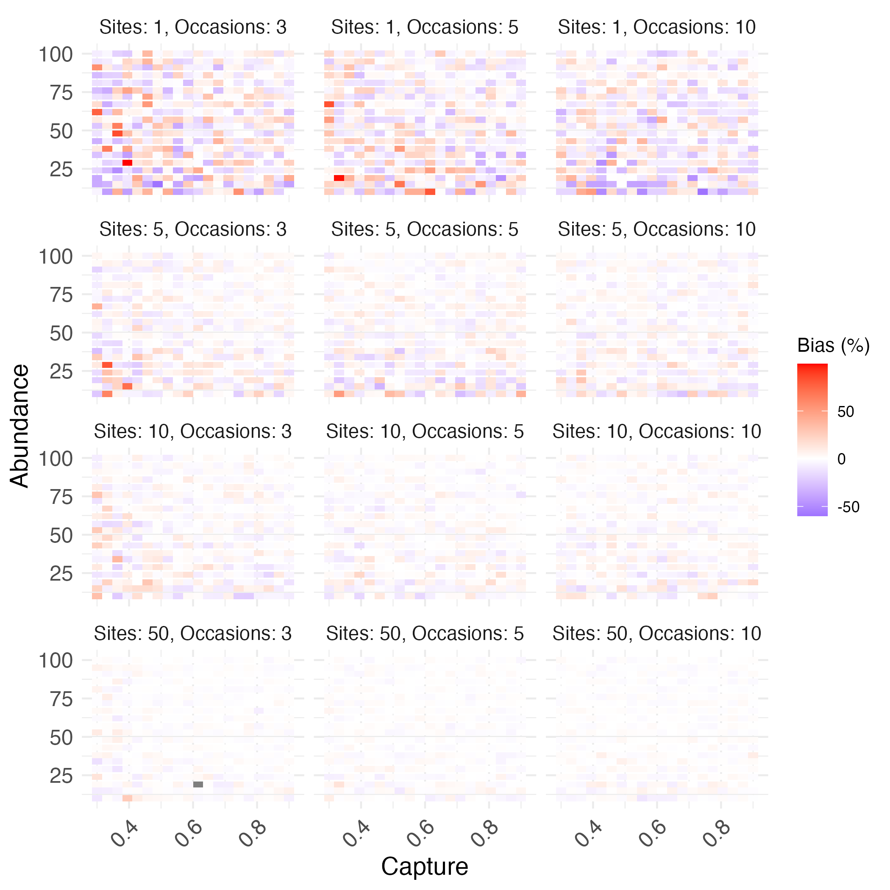

\small

^1^ CEFE, Univ Montpellier, CNRS, EPHE, IRD, Montpellier, France

`*` Corresponding author: olivier.gimenez@cefe.cnrs.fr

\normalsize

\vspace{1cm}
\hrule

blabla. 

\vspace{3mm}
\hrule
\vspace{5mm}

*Keywords*: Invasive species, Multinomial N-mixture, Population size, Statistical ecology

\bleft
\newpage

```{r setup, include=FALSE, cache=FALSE, message = FALSE}
library("knitr")
opts_chunk$set(echo = FALSE, warning = TRUE, message = TRUE)
opts_chunk$set(tidy = TRUE, comment = NA, highlight = TRUE)
opts_chunk$set(fig.path = "output/figures/")
```


```{r knitcitations, cache = FALSE}
library(knitcitations)
cleanbib()   
cite_options(citation_format = "pandoc")
```


# Introduction

Invasive species are a significant global issue, with wide-ranging impacts on ecosystems, economies, and public health [@Roy2024; @Petr2020]. Among these, the financial, epidemiological, social, and ecological costs associated with invasive rodents are substantial, as they damage infrastructures, degrade agricultural systems, and act as reservoirs for zoonotic diseases [@Diagne2023].

Effective management of invasive species requires the estimation of population abundance for guiding control efforts and evaluating the success of eradication or regulation programs [@Thompson2021; @Williams2002]. However, the challenge in estimating animal abundance is that individuals are not always observed even when present due to imperfect detection [@Seber2023; @Borchers2002]. Ignoring imperfect detection leads to biased estimates of population abundance [@Kery2008]. To account for imperfect detection, capture-recapture methods are usually used to correct observed counts [@Mccrea2015]. Yet, for invasive species, capture-recapture is often impractical, as ethical and management concerns typically prevent the release of captured animals. 

An alternative approach involves the use of removal methods [@Rodriguez2021] in which individuals are captured and permanently removed from the study area during successive sampling occasions. This process leads to a decrease in the expected number of captures by a consistent proportion over time (rather than by a fixed amount decline), which informs on the total abundance as the initial population determines how quickly the number of individuals available for capture diminishes. 

While standard removal methods are well-established [@Moran1951; @Zippin1956; @Zippin1958; @Rodriguez2021], recent advances in population ecology are still underutilized in the context of invasive species. Hierarchical models in particular ont percé [@RD2008; @KR2015] comme ils permettent de i) séparer clairement/formellent the biological processes of interest (e.g., population dynamics) from observation processes (e.g., imperfect detection) et donc d'aider à bien modéliser, et ii) allow the inclusion of environmental, spatial, or temporal covariates at multiple levels to explore how different factors influence ecological processes, iii) by modeling parameters hierarchically, information can be shared across groups or regions, improving estimates for smaller datasets (known as "partial pooling" and random effects). This is especially useful when some groups have limited data but still share common characteristics with others. 

While standard removal methods are well-established [@Moran1951; @Zippin1956; @Zippin1958; @Rodriguez2021], recent advances in population ecology remain underutilized in the context of invasive species. Hierarchical models, in particular, have gained tractino [@RD2008; @KR2015] due to their ability to: (i) explicitly separate biological processes of interest (e.g., population dynamics) from observation processes (e.g., imperfect detection), thus enabling more accurate modeling; (ii) incorporate environmental, spatial, or temporal covariates at multiple levels, allowing exploration of how various factors influence ecological processes; and (iii) share information across groups by modeling parameters hierarchically with random effects, which improves estimates for groups with fewer data.

In this paper, I showcase the application of a hierarchical formulation of removal models, the multinomial N-mixture model [@Dorazio2005], to estimate the abundance of an invasive coypu (*Myocastor coypus*) population in southern France. Coypu, a rodent native to South America, has established widespread invasive populations in France, where it causes extensive damage to infrastructure and crops and acts as a healthy carrier of leptospirosis, a potentially serious zoonotic disease [@Bonnet2021; @Bonnet2023]. Using removal data, I demonstrate the implementation of the multinomial N-mixture model to estimate coypu abundance, exploring both frequentist and Bayesian approaches. Furthermore, I investigate how detection probabilities and abundance are influenced by habitat and climatic factors. Finally, I conduct a simulation study to evaluate the performance of the multinomial N-mixture model under varying numbers of sampling sites and occasions. 

# Methods

## Multinomial N-mixture model

<!-- Think of a coin. There is a 1 in 2 chance of landing on heads, and a 1 in 2 chance of landing on tails. If I flip this coin 30 times, I expect to get 15 heads and 15 tails on average. In this experiment, the number of heads, denoted $y$, follows a binomial distribution with parameters the number of flips (30) and the probability $1/2$.  -->

Think of a die with six sides. The die has a 1 in 6 chance of landing on face 1, the same for face 2, and so on. If I roll the die 30 times, I expect to get face 1 five times, face 2 five times, and so on, on average. In this experiment, $y_1$, the vector made of the number of 1s, $y_2$, the number of 2s, $\ldots$, and $y_6$, the number of 6s, follows a multinomial distribution with parameters the number of rolls (30) and probabilities $(1/6, 1/6, ..., 1/6)$.

Now think of a removal campaign conducted over 3 months. We record the number of coypu $y_1$ captured in month 1, $y_2$ in month 2, $y_3$ in month 3, and let $y_4$ represent the number of coypu never captured. Let $p$ be the probability of capturing a coypu in a given month. The probability of capturing a coypu in the first month is $\pi_1 = p$. The probability of capturing a coypu in the second month is $\pi_2 = (1-p)p$ the probability of not capturing it in the first month $(1 - p)$ multiplied by the probability of capturing it in the second month $p$. The probability of capturing a coypu in the third month is $\pi_3 = (1-p)(1-p)p$, the probability of not capturing it in the first and second months, $(1 - p)(1 - p)$, multiplied by the probability of capturing it in the third month, $p$. Finally, the probability of never being captured is $\pi_4 = 1 - (p + (1-p)p + (1-p)(1-p)p)$ the complement of the probability of being captured in the first, second, or third month. 

If we assume that $N$ represents the abundance, then we have that the vector of counts $(y_1, y_2, y_3, y_4)$ follows a multinomial distribution with parameters $N$ and probabilities $(\pi_1,\pi_2,\pi_3,\pi_4)$. INTRODUCE $N \sim \text{Poisson}(\lambda)$. AND NEGATIVE BINOMIAL. ALSO SEVERAL SITES. EXPLAIN LA PARTIE HIERARCHIQUE ICI. METTRE UN EFFET ALEATOIRE QUELQUE PART? 

FAIRE LE LIEN ENTRE LE DE ET LA CAMPAGNE DE PIEGEAGE. 

Parameters $N$, $p$, and $\lambda$ are unknown and need to be estimated. In a frequentist framework, marginalization is performed by summing over all possible values of $N$. In a Bayesian framework, all these parameters are estimated directly, which simplifies the process.

Both parameters, $N$ and $p$, can be modeled as functions of explanatory spatial variables, in the spirit of generalized linear models, and logistic regressions for example. 

Citer chapitre dans bouquin de Kéry and Royle qui va bien (vol I). 

## Case study

To illustrate the approach, I investigated the impact of human disturbance on the occupancy of European otter (*Lutra lutra*) in France. The otter, a semi-aquatic mammal, faced near extinction in the 20th century in France due to extensive hunting for its fur. With hunting bans and protection efforts, the species is now recolonizing the country, and the ecological question is assessing its current distribution. Data on otter detection and non-detection were collected in 2003-2005 in the Midi-Pyrénées region. Observers searched for signs of otter presence at a small river catchment scale, which was used as the spatial sampling unit. 

Pour muskrats: https://ipt.nlbif.nl/resource?r=hwh_muskrat_1987-2014#anchor-versions and https://www.gbif.org/dataset/7d75109d-a6cb-4e90-89d0-79d08577c580. 

Tableau avec les données. Et les covariables. 

## Implementation

For all analyses, I used the statistical language `R` `r citep(citation())`. I used the `tidyverse` `r citep(citation("tidyverse"))` suite of packages for data manipulation and visualization and `sf` `r citep(citation("sf")[[1]])` for dealing with spatial data. I fitted models within the frequentist framework... unmarked  `r citep(citation("unmarked")[[1]])`. Bayesian framework using the `ubms` `r citep(citation("ubms"))` package. I specified weakly informative priors for all parameters, specifically normal distributions with mean 0 and standard deviation 1.5 for regression parameters, and uniform distributions for the partial sill, range parameter and detection probability. I ran two chains for a total of 15,000 iterations with a burn-in of 5,000 iterations. I summarized posterior distributions with posterior mean and 95\% credible intervals. I assessed model convergence using R-hat values (< 1.1), effective sample size (> 100), and visual inspection of the trace plots. 

## Simulation study

Voir un peu comment se comporte le modèle en fonction du nombre de sites et d'occasions. Prendre la prob de capture du cas d'étude coypu. 

I conducted a simulation study to evaluate model performance by examining parameter bias and prediction error. I simulated a stream network over $S = 100$ sites using an exponential tail-down structure (inspired by the case study, see previous section) with partial sill $\sigma^2 = 2$ and range parameter $\theta = 10$. I considered a single covariate, normally distributed with mean 0 and standard deviation 1, with a linear effect (on the logit scale) on the occupancy probability with intercept $\beta_0 = 0.5$ and slope $\beta_1 = 1$. I simulated the observation process with a detection probability $p = 0.6$ across 5 repeated visits per site. I fitted both models, with and without spatial autocorrelation, to the simulated data, and I repeated this procedure 100 times. Eventually, I calculated the relative bias for each parameter and the root mean square prediction error (RMSPE) for each model. Unmarked only to speed up process. 

# Results and discussion

Here, I provide the parameter estimates from the new model accommodating spatial autocorrelation (see also Fig. \@ref(fig:bias)), unless otherwise specified. Detection probability was less than one, estimated at 0.71 (0.59, 0.80), which justified the use of occupancy models. The proportion of cultivated area had no effect, with a slope estimated at 0.60 (-0.67, 1.96). Population density also had no effect on occupancy probability, with a slope estimated at -0.96 (-2.24, 0.17). However, I did find a negative effect when spatial autocorrelation was ignored, with a slope estimated at -1.10 (-1.99, -0.34). This latter result aligns with a previous analysis of a more extensive dataset [@Couturier2024] that also ignored spatial autocorrelation.

As anticipated, the effect size of human density increased when spatial autocorrelation was ignored. The most likely explanation for this is a bias due to an omitted variable. There is spatial autocorrelation in human density, which inflates its effect size; this bias is controlled for when spatial autocorrelation is included in the model. There must be spatial variation in occupancy probabilities attributable to another variable that needs to be accounted for.

The results of the simulation study underscored the importance of accounting for spatial autocorrelation. Ignoring spatial autocorrelation led to a relative bias of -26% in the slope of the covariate, compared to just 0.7% when spatial autocorrelation was included. Although the range parameter exhibited substantial bias (330%), this outcome was expected. In spatial models, there is typically a strong positive relationship between the range parameter and the partial sill [@zhang2004; @VerHoef2024], which showed a bias of 12%. Importantly, the ratio of the range parameter to the partial sill can be reliably estimated [@zhang2004], as evidenced by its negligible bias (0.9%). Overall, the root mean square prediction error (RMSPE) was lower for the model with spatial correlation (RMSPE = 0.18) compared to the model without it (RMSPE = 0.23).

Two short-term perspectives arise from this work. From a methodological perspective, the new approach could be extended to multi-season occupancy models, enabling the modeling of colonization probability as a function of distance to habitat features that may impede species movement [e.g., @Kervellec2023]. This would facilitate the quantification of landscape connectivity in freshwater ecosystems. Such development requires moving to spatio-temporal models for stream and river data, which have recently become avaible [@Santos2022]. From an ecological perspective, the new approach presents significant potential for the analysis of environmental DNA (eDNA). The eDNA methodology offers substantial promise for the non-invasive monitoring of biodiversity in freshwater ecosystems [@Carraro2020]. While spatial stream network models have been employed to analyze eDNA data [@Winkowski2024], these models have overlooked the issue of imperfect detection. Previous studies have recognized occupancy models as effective tools for eDNA data analysis [@Burian2021], with some considering spatial autocorrelation [@Chen2019], however they have yet to integrate spatial stream networks. The new approach addresses this gap by incorporating both imperfect detection and spatial stream networks.

Recommendation. Record effort, 0s from non-sampling and 0s for non-detections. Close-kin as alternative. Use for projections. Also multispecies (cf N-mixture multispecies). Also immigration et papers par d'autres sur multinomial N-mixture extensions. Here, just AR(1) as in @Outhwaite2018 random walk, mais mechanisms et demog parameters possible. Effectifs en eux-memes un peu meaningless, boucle de gestion adaptative. 

Two main assumptions: constant capture, closed pop.

Pb lack of fit. Main three are overdispersion, ok with negative binomial (give results); closure ok w/ open models w/ survival/recruitment or simple multisession (papier census aérien); spatial autocorrelation, ok en classique (GAM ou autre), et aussi possible w/ stream networks pour coypus; iv) Hierarchical models are well-suited for representing dependencies in space, time, or species interactions, which are common in ecological systems.

Pour ouvert, papier Eleni open (mais permanent emigration) [@Matechou2016], puis Zhou pour temporary emigration [@Zhou2019]. Ajouter aussi le papier de Link pour dispersal [@Link2018]. 

Un peu chiant unmarked. Avantage bayésien. No boundary estimates, easy random effects. 

Difference entre population et species. 

Les hypothèses du modèle. Ici ou en discussion. Population fermée: pas de naissances/morts ou émigration/immigration pendant la période de piégeage. Les sites de piégeage sont indépendants: les prélèvements sur un site n’affectent pas ceux faits sur un autre site. 

Lack of fit, overdispersion and negative binomial. 

Si random effect site pas pertinent, on peut faire du spatial autocorrelation avec RSR. Easy avec ubms, possible aussi avec NIMBLE (https://wildlife.onlinelibrary.wiley.com/doi/10.1002/jwmg.22296). Pas possible avec unmarked. 

Pour l'ouvert, possible avec unmarked, pas ubms. OK avec NIMBLE. 

Pour NB, pas possible avec ubms. OK avec NIMBLE et unmarked. 

# Acknowledgments

I would like to warmly thank X and Y for data. 

# Ethics and Integrity statements

Not applicable. 

## Data availability statement

Data and code are available at \href{https://github.com/oliviergimenez/counting-coypus}{https://github.com/oliviergimenez/counting-coypus}.

## Funding statement

Ici mettre financement UM. 

## Conflict of interest disclosure

The author has no conflicts of interest to declare.

# References

```{r write_citations, cache=FALSE, include=FALSE}
write.bibtex(file = "knitcitations.bib")
```

::: {#refs}
:::

\eleft

\clearpage

\newpage

```{r bias, out.width="98%", fig.align='center', fig.pos='b', fig.cap="Relative bias."}

```
