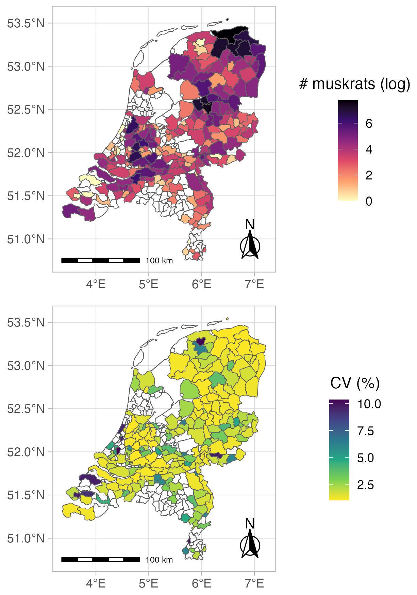

\small

^1^ CEFE, Univ Montpellier, CNRS, EPHE, IRD, Montpellier, France

`*` Corresponding author: olivier.gimenez@cefe.cnrs.fr

\normalsize

\vspace{1cm}
\hrule

blabla. 

\vspace{3mm}
\hrule
\vspace{5mm}

*Keywords*: Invasive species, Multinomial N-mixture, Population size, Statistical ecology

\bleft
\newpage

```{r setup, include=FALSE, cache=FALSE, message = FALSE}
library("knitr")
opts_chunk$set(echo = FALSE, warning = TRUE, message = TRUE)
opts_chunk$set(tidy = TRUE, comment = NA, highlight = TRUE)
opts_chunk$set(fig.path = "output/figures/")
```


```{r knitcitations, cache = FALSE}
library(knitcitations)
cleanbib()   
cite_options(citation_format = "pandoc")
```


# Introduction

Invasive species are a significant global issue, with wide-ranging impacts on ecosystems, economies, and public health [@Roy2024; @Petr2020]. Among these, the financial, epidemiological, social, and ecological costs associated with invasive rodents are substantial, as they damage infrastructures, degrade agricultural systems, and act as reservoirs for zoonotic diseases [@Diagne2023].

Effective management of invasive species requires the estimation of population abundance for guiding control efforts and evaluating the success of eradication or regulation programs [@Thompson2021; @Williams2002]. However, the challenge in estimating animal abundance is that individuals are not always observed even when present due to imperfect detection [@Seber2023; @Borchers2002]. Ignoring imperfect detection leads to biased estimates of population abundance [@Kery2008]. To account for imperfect detection, capture-recapture methods are usually used to correct observed counts [@Mccrea2015]. Yet, for invasive species, capture-recapture is often impractical, as ethical and management concerns typically prevent the release of captured animals. 

An alternative approach involves the use of removal methods [@Rodriguez2021] in which individuals are captured and permanently removed from the study area during successive sampling occasions. This process leads to a decrease in the expected number of captures by a consistent proportion over time (rather than by a fixed amount decline), which informs on the total abundance as the initial population determines how quickly the number of individuals available for capture diminishes. 

While standard removal methods are well-established [@Moran1951; @Zippin1956; @Zippin1958; @Rodriguez2021], recent advances in population ecology remain underutilized in the context of invasive species. Hierarchical models, in particular, have gained traction [@RD2008; @KR2015] due to their ability to: (i) explicitly separate biological processes of interest (e.g., population dynamics) from observation processes (e.g., imperfect detection), thus enabling more accurate modeling; (ii) incorporate environmental, spatial, or temporal covariates at multiple levels, allowing exploration of how various factors influence ecological processes; and (iii) share information across groups by modeling parameters hierarchically with random effects, which improves estimates for groups with fewer data.

In this paper, I showcase the application of a hierarchical formulation of removal models, the multinomial N-mixture model [@Dorazio2005], to estimate the abundance of rodents in Europe. In this study, I focus on the coypu (*Myocastor coypus*) in France and the muskrat (*Ondatra zibethicus*) in the Netherlands. Both species are semi-aquatic rodents introduced to Europe in the early 20th century following escapes or releases from fur farms. The coypu, native to South America, has formed widespread invasive populations in France [@Bonnet2023], where it causes significant damage to infrastructure and crops. Additionally, it serves as a healthy carrier of leptospirosis, a zoonotic disease with potentially serious consequences. Similarly, the muskrat, native to North America, has established extensive populations in the Netherlands. By burrowing into riverbanks, dykes, and dams, muskrats compromise the integrity of these structures, posing a threat to public safety [@vanloon2017].

Using removal data, I demonstrate the application of the multinomial N-mixture model to estimate the abundance of rodent populations. First, I conduct a simulation study to evaluate the model's performance under varying numbers of sampling sites and sampling occasions. Second, I present a case study on a coypu population in France to illustrate the hierarchical structure of the multinomial N-mixture model, demonstrating how covariates can be incorporated to account for variations in abundance and capture probabilities. Third, I use a case study on muskrats in the Netherlands to demonstrate the integration of random effects within the model. To facilitate reproducibility, I provide the accompanying code and data, aiming to promote the broader adoption of removal models in the study of biological invasions.

# Methods

## Multinomial N-mixture model

<!-- Think of a coin. There is a 1 in 2 chance of landing on heads, and a 1 in 2 chance of landing on tails. If I flip this coin 30 times, I expect to get 15 heads and 15 tails on average. In this experiment, the number of heads, denoted $y$, follows a binomial distribution with parameters the number of flips (30) and the probability $1/2$.  -->

Think of a dice with six sides. The dice has a 1 in 6 chance of landing on face 1, the same for face 2, and so on. If I roll the dice 30 times, I expect to get face 1 five times, face 2 five times, and so on, on average. In this experiment, $y_1$, the vector made of the number of 1s, $y_2$, the number of 2s, $\ldots$, and $y_6$, the number of 6s, follows a multinomial distribution with parameters the number of rolls (30) and probabilities $(1/6, 1/6, ..., 1/6)$.

Now think of a removal campaign conducted over 3 months. We record the number of rodents $y_1$ captured in month 1, $y_2$ in month 2, $y_3$ in month 3, and let $y_4$ represent the number of rodents never captured. Let $p$ be the probability of capturing a rodent in a given month. The probability of capturing a rodent in the first month is $\pi_1 = p$. The probability of capturing a rodent in the second month is $\pi_2 = (1-p)p$ the probability of not capturing it in the first month $(1 - p)$ multiplied by the probability of capturing it in the second month $p$. The probability of capturing a rodent in the third month is $\pi_3 = (1-p)(1-p)p$, the probability of not capturing it in the first and second months, $(1 - p)(1 - p)$, multiplied by the probability of capturing it in the third month, $p$. Finally, the probability of never being captured is $\pi_4 = 1 - (p + (1-p)p + (1-p)(1-p)p)$ the complement of the probability of being captured in the first, second, or third month. If we assume that $N$ represents the abundance, then we have that the vector of counts $(y_1, y_2, y_3, y_4)$ follows a multinomial distribution with parameters $N$ and probabilities $(\pi_1,\pi_2,\pi_3,\pi_4)$. In general, we assume that $N$ follows a Poisson distribution with parameter the expected number of rodents denoted $\lambda$. And there you have it, the multinomial N-mixture model for a removal experiment, which is similar to throwing a dice $N$ times and the $\pi's$ give the probabilities that I get a given face of that dice. In general, we monitor rodents on several sites $i = 1,\ldots,S$ and we need to estimate local population size $N_i$ for site $i$. AJOUTER L'INTERET D'AVOIR PLUSIEURS SITES (cf ABSTRACT PAPIER DORAZIO) AND POLISH TEXT. 

Parameters $N$, $p$, and $\lambda$ are unknown and need to be estimated. In a frequentist framework, marginalization is performed by summing over all possible values of $N$ [@Dorazio2005]. In a Bayesian framework, all these parameters are estimated directly, which simplifies the process [@RD2006]. Both parameters, $\lambda$ and $p$, can be modeled as functions of explanatory spatial and temporal variables, in the spirit of generalized linear models, and Poisson or logistic regressions for example. I warmly recommend chapter 7 in @KR2015 for a detailed description of the multinomial mixture model. 

MODEL HYPOTHESES. Ici ou en discussion.

<!-- The term multinomial N-mixture stands for the mixture of a multinomial observation model with respect to a Poisson model for abundance. -->

# Simulations

I conducted a simulation study to evaluate the model's performance by examining parameter bias under varying numbers of sampling sites and sampling occasions. I simulated removal data over 1, 5, 10 and 50 sites using a Poisson distribution with expected number of animals $\lambda$ between 10 and 100 (20 values) for the ecological process. I simulated the observation process with a capture probability $p$ varying between 0.3 and 0.9 (20 values) across 3, 5 and 10 occasions per site. In total, I considered 4800 scenarios. I fitted the multinomial N-mixture model to the simulated data within the frequentist framework using function `multinomPois()` in the `R` package `unmarked` `r citep(citation("unmarked")[[1]])`, and I repeated this procedure 500 times. Eventually, I calculated the relative bias for each parameter.

# Case studies

<!-- We can express the model in terms of the conditional multinomial observation model. This method breaks the multinomial observation model up into two pieces: a multinomial conditioned on a known sample size (being the number of encountered individuals) and a binomial with the unknown sample size. -->

EXPLAIN THE AIM OF EACH CASE STUDY.

## Coypus in France

Removal data on coypus were collected from annual control operations conducted since 2015 in several cities within the Hérault department, located in the Occitanie region of southern France. These operations are carried out year-round, with the exception of July and August. Coypus are trapped using cages by a network of volunteers coordinated by the Syndicat Mixte du Bassin de l'Or and the Fédération Départementale des Chasseurs de l'Hérault. For this study, I focus on data from 2022, specifically from sampling occasions in February, March, and April. The data, covering $S = 6$ cities, are summarized in Table \@ref(tab:coypus). I fitted a model where the expected number of coypus was modeled as a function of temperature, while the capture probability was allowed to vary by month.

\begin{table}[ht]
\centering
\begin{tabular}{lcccc}
\hline
\textbf{} & \textbf{Removed in} & \textbf{Removed in} & \textbf{Removed in} & \textbf{Averaged} \\
\textbf{City} & \textbf{February} & \textbf{March} & \textbf{April} & \textbf{temperature}\\
\hline
Candillargues & 18	& 12	& 38 & 9.5 \\
Lansargues    & 15	& 17	& 75 & 8.8 \\
Mauguio       & 20	& 9	& 6 & 9.2 \\
Saint-Nazaire-de-Pézan & 169	& 41	& 15 & 9.3 \\
Saint-Just    & 85	& 61	& 77 & 9.2 \\
Valergues     & 0 & 1	& 3 & 9.4 \\
\hline
\end{tabular}
\caption{Number of invasive coypus removed monthly, and averaged 3-month temperature in several cities of the Hérault department for the year 2022.}
\label{tab:coypus}
\end{table}

## Muskrats in the Netherlands

Removal data on muskrats in the Netherlands were collected by professional trappers. The data were registered in atlas blocks (5 x 5 km) per periods of four weeks. For this study, I focus on data from 2014, specifically from sampling occasions in January, February, and March. The data were made available through the LIFE MICA project [@Cartuyvels2024] and can be freely downloaded from <https://www.gbif.org/dataset/7d75109d-a6cb-4e90-89d0-79d08577c580>. I fitted the same model as for the coypus data, except that I added a site random effect on abundance to accommodate the spatial variation that was not explained by temperature. 

## Implementation

For all analyses, I used the statistical language `R` `r citep(citation())`. I used the `tidyverse` `r citep(citation("tidyverse"))` suite of packages for data manipulation and visualization, `sf` `r citep(citation("sf")[[1]])` for dealing with spatial data and `krigR` `r citep(citation("KrigR"))` to get temperature data. For the two case studies, I fitted models within a Bayesian framework using Markov chain Monte Carlo (MCMC) algorithms. I used both the `NIMBLE` `r citep(citation("nimble")[[1]])` and the `ubms` `r citep(citation("ubms"))` packages. The former offers high flexibility, enabling users to define custom likelihoods, though it requires manual coding, while the latter features simpler syntax with pre-built multinomial N-mixture models, albeit limited to a Poisson distribution for abundance. I specified weakly informative priors for all parameters, specifically normal distributions with mean 0 and standard deviation 1.5 for regression parameters, and a uniform distribution for the standard deviation of the random effects. I ran two chains for a total of 15,000 iterations with a burn-in of 5,000 iterations. I summarized posterior distributions with posterior mean and 95\% credible intervals. I assessed model convergence using R-hat values (< 1.1), effective sample size (> 100), and visual inspection of the trace plots. 

# Results

The results of the simulation study underscored the importance of accounting for spatial autocorrelation - see Figure \@ref(fig:bias). Ignoring spatial autocorrelation led to a relative bias of -26% in the slope of the covariate, compared to just 0.7% when spatial autocorrelation was included. Although the range parameter exhibited substantial bias (330%), this outcome was expected.

Coypus case study. The temperature had a negative effect on abundance, with a slope estimated at -0.14 (-0.22, -0.07). Capture probabilities were estimated at 0.43 (0.29, 0.49) in February, 0.35 (0.19, 0.44) in March and 0.84 (0.35, 1.00) in April. Posterior distributions of abundance are in Figure \@ref(fig:pdcoypus).

Muskrats case study. The temperature had a negative effect on abundance, with a slope estimated at -0.48 (-0.70, -0.26). The standard deviation of the site random effect was estimated at 1.62 (1.46, 1.79). Capture probabilities were estimated at 0.12 (0.05, 0.25) in January, 0.25 (0.15, 0.35) in February and 0.60 (0.53, 0.75) in March. Estimated abundance is in Figure \@ref(fig:muskrats) with coefficient of variation.

# Discussion

Simulations. In line with bat study that found little bias in removal models. "Use of the removal model with data from repeated mist-net surveys may allow resource managers and conservationists to better quantify how resource management and landscape composition affect bat species abundance and overall populations". [@Womack2019]

The European Union Regulation No. 1143/2014 was established to mitigate the negative impacts of invasive alien species on biodiversity. This regulation outlines measures to prevent the introduction of invasive alien species and manage their established populations. Two species listed as species of Union Concern under the regulation, which obligates member states to implement appropriate management actions.

Two short-term perspectives arise from this work. From a methodological perspective, the new approach could be extended to multi-season occupancy models, enabling the modeling of colonization probability as a function of distance to habitat features that may impede species movement [e.g., @Kervellec2023]. This would facilitate the quantification of landscape connectivity in freshwater ecosystems. Such development requires moving to spatio-temporal models for stream and river data, which have recently become avaible [@Santos2022]. From an ecological perspective, the new approach presents significant potential for the analysis of environmental DNA (eDNA). The eDNA methodology offers substantial promise for the non-invasive monitoring of biodiversity in freshwater ecosystems [@Carraro2020]. While spatial stream network models have been employed to analyze eDNA data [@Winkowski2024], these models have overlooked the issue of imperfect detection. Previous studies have recognized occupancy models as effective tools for eDNA data analysis [@Burian2021], with some considering spatial autocorrelation [@Chen2019], however they have yet to integrate spatial stream networks. The new approach addresses this gap by incorporating both imperfect detection and spatial stream networks.

Overdispersion. No more temperature effect. Coypus -0.27 (-1.30, 0.59).

Recommendation. Record effort, 0s from non-sampling and 0s for non-detections. Close-kin as alternative. Use for projections. Also multispecies (cf N-mixture multispecies). Also immigration et papers par d'autres sur multinomial N-mixture extensions. Here, just AR(1) as in @Outhwaite2018 random walk, mais mechanisms et demog parameters possible. Effectifs en eux-memes un peu meaningless, boucle de gestion adaptative. 

Two main assumptions: constant capture, Poisson distribution, closed pop and independence of sites. 

Pb lack of fit. Main three are overdispersion, ok with negative binomial (give results); closure ok w/ open models w/ survival/recruitment or simple multisession (papier census aérien); spatial autocorrelation, ok en classique (GAM ou autre), et aussi possible w/ stream networks pour coypus; iv) Hierarchical models are well-suited for representing dependencies in space, time, or species interactions, which are common in ecological systems.

Pour ouvert, papier Eleni open (mais permanent emigration) [@Matechou2016], puis Zhou pour temporary emigration [@Zhou2019]. Ajouter aussi le papier de Link pour dispersal [@Link2018]. 

Un peu chiant unmarked. Avantage bayésien. No boundary estimates, easy random effects. 

Difference entre population et species. 

Les hypothèses du modèle. Ici ou en discussion. Population fermée: pas de naissances/morts ou émigration/immigration pendant la période de piégeage. Les sites de piégeage sont indépendants: les prélèvements sur un site n’affectent pas ceux faits sur un autre site. 

Lack of fit, overdispersion and negative binomial. 

Si random effect site pas pertinent, on peut faire du spatial autocorrelation avec RSR. Easy avec ubms, possible aussi avec NIMBLE (https://wildlife.onlinelibrary.wiley.com/doi/10.1002/jwmg.22296). Pas possible avec unmarked. 

Pour l'ouvert, possible avec unmarked, pas ubms. OK avec NIMBLE. 

Pour NB, pas possible avec ubms. OK avec NIMBLE et unmarked. 

MOVED FIGURES WHERE I CALL THEM.

Increase in temperature, hence décrochage de la relation entre abundance et température; to test that, 1987-2014, et on régresse les yearly-specific slope sur l'année; negative trend in the slope of the effect of temp on abundance avec -0.04062367 (-0.04192120, -0.0393461).

# Acknowledgments

I would like to warmly thank Nathalie et Tanguy for France and LIFE MICA for Netherlands. 

## Data availability statement

Data and code are available at \href{https://github.com/oliviergimenez/counting-rodents}{https://github.com/oliviergimenez/counting-rodents}.

## Funding statement

Ici mettre financement UM. 

## Conflict of interest disclosure

The author has no conflicts of interest to declare.

# References

```{r write_citations, cache=FALSE, include=FALSE}
write.bibtex(file = "knitcitations.bib")
```

::: {#refs}
:::

\eleft

\clearpage

\newpage

```{r datsmuskrats, out.width="100%", fig.align='center', fig.pos='b', fig.cap="Data. Top removal data. Bottom temperature. DIFFICILE DE FAIRE LA DIFFERENCE AVEC LES DONNEES NON?"}

```

\clearpage

\newpage

```{r bias, out.width="98%", fig.align='center', fig.pos='b', fig.cap="Relative bias."}

```

\clearpage

\newpage

```{r pdcoypus, out.width="98%", fig.align='center', fig.pos='b', fig.cap="Posterior abundance."}
include_graphics("hist_coypus.png")
```

\clearpage

\newpage

```{r muskrats, out.width="95%", fig.align='center', fig.pos='b', fig.cap="Muskrats."}

```

